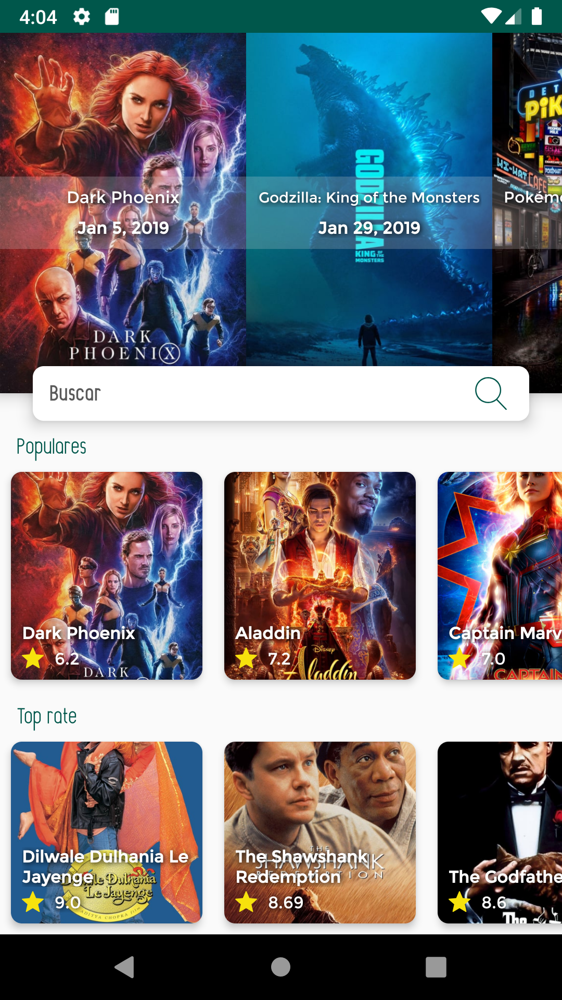

# TMDB 

App básica para consumo de API https://developers.themoviedb.org/ en Android

Descripción de contenido:

Capas:
  * Negocio (tmdp): MVP de las clases que muestran el listado de las películas y/o su detalle.
  
  * Vistas personalizadas (customviews):  
      - AutoResizeTextView: permite adaptar el tamaño de los textos en diferentes resoluciones y tamaños de la pantalla.
      - Activity: clase genérica para inicializar las transiciones entre Activities
      - ImageMovieView: Custom ImageView para hacer la carga de las imagenes con Picasso manejando su MVP y mostrando: animación carga de imagen: imagen descargada o animación de error.
      
  * Extensiones: Custom Kotlin extensions. Estas para reciclar código y hacer un poco más legible/reducido el código, además de facilitar funciones.
  
  * net.api: este paquete contiene manejadores para el consumo de la Api de TMDB:
      https://medium.com/@jassmel05/consume-restful-api-with-kotlin-1b9b14db3f28
      - ApiClient: realiza el consumo de servicios y regresa los objetos a la clase que los solicitó
      - ApiResponse: procesa la respuesta del servidor y retorna un status [true-false], mensaje (String) y un JSON de la respuesta
      - ApiRoute: contiene las URL base y genera la URL completa dependiendo de lo solicitado (Upcoming movies, Top rate, Search movies, etc)
      
# ¿En qué consiste el principio de responsabilidad única? ¿Cuál es su propósito?
  Consiste en delegar responsabilidades a cada paquete, clase, método y/o variable; para que cada parte haga lo único que se le está indicando (generalmente se sabe la responsabilidad por el nombre asignado)
  
# ¿Qué características tiene un “buen” código o código limpio?

Un buen código siempre puede ser legible, reutilizable y fácil de mantener, por lo que un buen código debería de ser un código limpio. No importa si el código o las clases realizan una función compleja, pero si no se entiende el proceso y no es legible, entonces no es un buen código.
    
